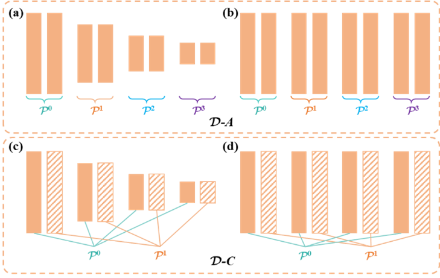
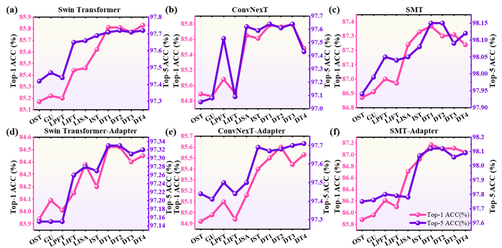

# Diffusion-Tuning
This is the code base for **`"Diffusion Tuning: A Step-by-Step Fine-Tuning Strategy for Deep Neural Networks Inspired by Physical Diffusion"`**, and the article is submitted to **`Knowledge-Based Systems`**.

## Abstract
As data size and computational power increase, the ‘pre-training + fine-tuning’ paradigm emerges in deep learning, where fine-tuning determines the model's performance on a new target task. Currently, mainstream methods, such as full fine-tuning (FFT) or parameter-efficient fine-tuning (PEFT), uniformly optimize all training parameters within a specified epoch, collectively referred to as one-step tuning (OST). However, our experiments reveal that OST cannot improve performance by extending the training time, for either vision models or language models, indicating a bottleneck in knowledge transfer. Consequently, we introduce the concept of step-by-step tuning (SST), where the parameters of different parts of the model are gradually optimized in a specific order or strategy. Inspired by the physical diffusion process, we propose a novel SST strategy, diffusion tuning (DT), which divides the parameter space into multiple subspaces and progressively optimizes each. DT includes two approaches for optimizing parameters in subspaces and two methods for partitioning the parameter space. Compared with OST, we prove that DT has a tighter generalization bound in optimization, which provides theoretical proof of convergence. Over 170 experiments conducted on three visual models and two language models demonstrate that DT effectively alleviates the bottleneck of knowledge transfer and robustly improves the performance of baseline models across various tasks. Even with only half the training epoch of OST, DT can still achieve competitive results. DT is a model-independent and data-independent fine-tuning strategy, demonstrating the extrapolation from physical laws to parameter optimization and potentially inspiring broader exploration of SST by researchers.


## Results
**To learn more detail please read our paper**.




## Train and Test
We have provided detailed instructions for model training and testing and experimental details. 
### Install
- Clone this repo:

```bash
conda create -n dt python=3.10 -y
conda activate dt
git clone https://github.com/CAU-COE-VEICLab/Diffusion-Tuning.git
cd Diffusion-Tuning
```
- Install `CUDA>=10.2` with `cudnn>=7` following
  the [official installation instructions](https://docs.nvidia.com/cuda/cuda-installation-guide-linux/index.html)
- Install `PyTorch>=1.8.0` and `torchvision>=0.9.0` with `CUDA>=10.2`:

```bash
pip install torch==1.10.0+cu111 torchvision==0.11.0+cu111 torchaudio==0.10.0 -f https://download.pytorch.org/whl/torch_stable.html
pip install timm==0.4.12
pip install opencv-python==4.4.0.46 termcolor==1.1.0 yacs==0.1.8 pyyaml scipy
```


### Data preparation

We use standard ImageNet dataset, you can download it from http://image-net.org/. We provide the following two ways to
load data:

- For standard folder dataset, move validation images to labeled sub-folders. The file structure should look like:
  ```bash
  $ tree data
  imagenet
  ├── train
  │   ├── class1
  │   │   ├── img1.jpeg
  │   │   ├── img2.jpeg
  │   │   └── ...
  │   ├── class2
  │   │   ├── img3.jpeg
  │   │   └── ...
  │   └── ...
  └── val
      ├── class1
      │   ├── img4.jpeg
      │   ├── img5.jpeg
      │   └── ...
      ├── class2
      │   ├── img6.jpeg
      │   └── ...
      └── ...
 
  ```

### Evaluation

To evaluate a pre-trained `Swin Transformer` on ImageNet val, run:

```bash
python -m torch.distributed.launch --nproc_per_node <num-of-gpus-to-use>  main_diffusion_tuning.py --eval \
--cfg <config-file> --pretrained <checkpoint> --data-path <imagenet-path> 
```

**Notes**:

- Please note that when testing the results of Diffusion Tuning (DT1~DT4), select the configuration file (--cfg) of the original model (the yaml file that does not contain 'dt').

For example, to evaluate the `Swin-B-DT1` with a single GPU:

```bash
python -m torch.distributed.launch --nproc_per_node 1 main_diffusion_tuning.py --eval \
--cfg configs/diffusion_finetune/swin/swin/swin_base_patch4_window7_224_22kto1k_finetune.yaml --pretrained dt1_swin_base_patch4_window7_224_22k.pth --data-path <imagenet-path>
```

### Full Fine-tuning (FFT) from a ImageNet-22K(21K) pre-trained model

For example, using DT-1 as the training method to fine-tune a Swin-B model pre-trained on ImageNet-22K (21K):

```bashs
python -m torch.distributed.launch --nproc_per_node 8 main_diffusion_tuning.py \
--cfg configs/diffusion_finetune/swin/swin/dt1_swin_base_patch4_window7_224_22kto1k.yaml --pretrained swin_base_patch4_window7_224_22k.pth \
--data-path <imagenet-path> --batch-size 64 --accumulation-steps 2 --use-checkpoint --output <ouput-path> --tag swin_base_dt1
```

For example, using OST(one step tuning) as the training method to fine-tune a Swin-B model pre-trained on ImageNet-22K (21K):

```bashs
python -m torch.distributed.launch --nproc_per_node 8 main_diffusion_tuning.py \
--cfg configs/diffusion_finetune/swin/swin/swin_base_patch4_window7_224_22kto1k_finetune.yaml --pretrained swin_base_patch4_window7_224_22k.pth \
--data-path <imagenet-path> --batch-size 64 --accumulation-steps 2 --use-checkpoint --output <ouput-path> --tag swin_base_ost
```

### Parameter-Efficient Fine-tuning (PEFT) from a ImageNet-22K(21K) pre-trained model

For example, using DT-1 as the training method to fine-tune a Swin-B-Adapter model pre-trained on ImageNet-22K (21K):

```bashs
python -m torch.distributed.launch --nproc_per_node 8 main_diffusion_tuning.py \
--cfg configs/diffusion_finetune/swin/adapter-swin/dt1_adapter_swin_base_patch4_window7_224_22kto1k.yaml --pretrained swin_base_patch4_window7_224_22k.pth \
--data-path <imagenet-path> --batch-size 64 --accumulation-steps 2 --use-checkpoint --output <ouput-path> --tag swin_base_adapter_dt1
```

For example, using OST(one step tuning) as the training method to fine-tune a Swin-B model pre-trained on ImageNet-22K (21K):

```bashs
python -m torch.distributed.launch --nproc_per_node 8 main_diffusion_tuning.py \
--cfg configs/diffusion_finetune/swin/adapter-swin/adapter_swin_base_patch4_window7_224_22kto1k.yaml --pretrained swin_base_patch4_window7_224_22k.pth \
--data-path <imagenet-path> --batch-size 64 --accumulation-steps 2 --use-checkpoint --output <ouput-path> --tag swin_base_adapter_ost
```
## Practical Application

### AgriMaTech-LLaMA

To validate the effectiveness of diffusion tuning in specific tasks, we constructed a vertical domain supervised fine-tuning dataset for agricultural mechanization specialization - AgriMachine28K.  We then used LLaMA3.1-8B-Instruct as a base model and DT-3 as a training method on the AgriMachine28K and fine-tuning the base model to obtain AgriMaTech-LLaMA, a large language model in the field of assisted learning and teaching.  

you can click this [link](https://drive.google.com/drive/folders/1UYfqghaAWC0uqddyE6odlaGjKrjlsvQR?usp=drive_link) to download AgriMaTech-LLaMA.

**Notes**:

- The weights provided in the link are exclusively for LORA (Low-Rank Adaptation). You can load these weights using peft.PeftModel.from_pretrained provided by Hugging Face.

## Citation
