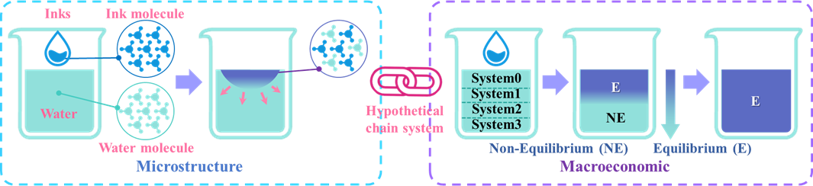
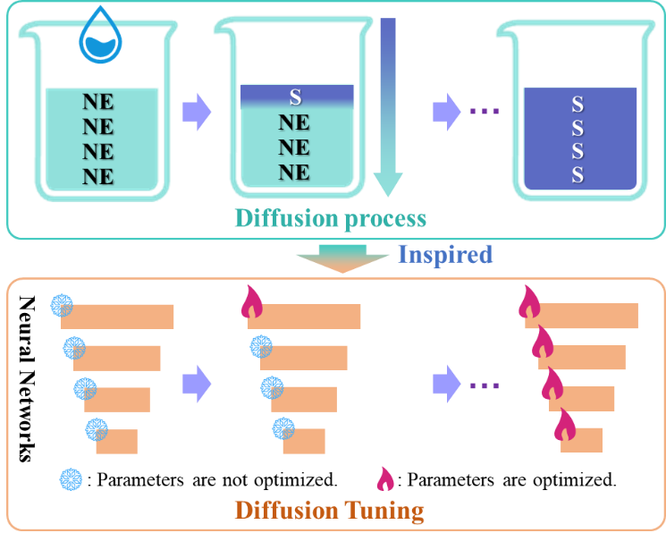
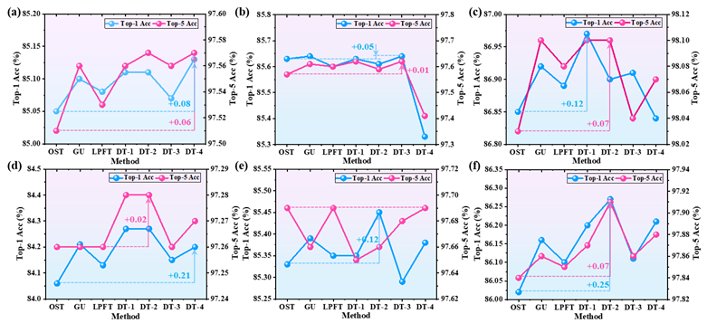
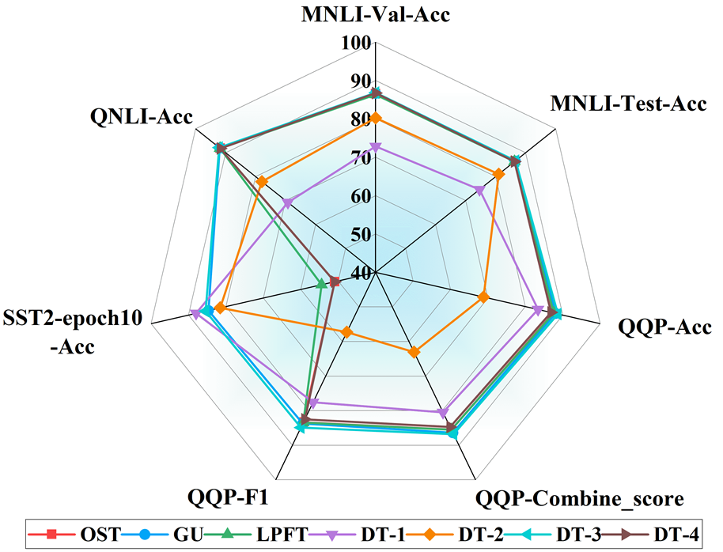
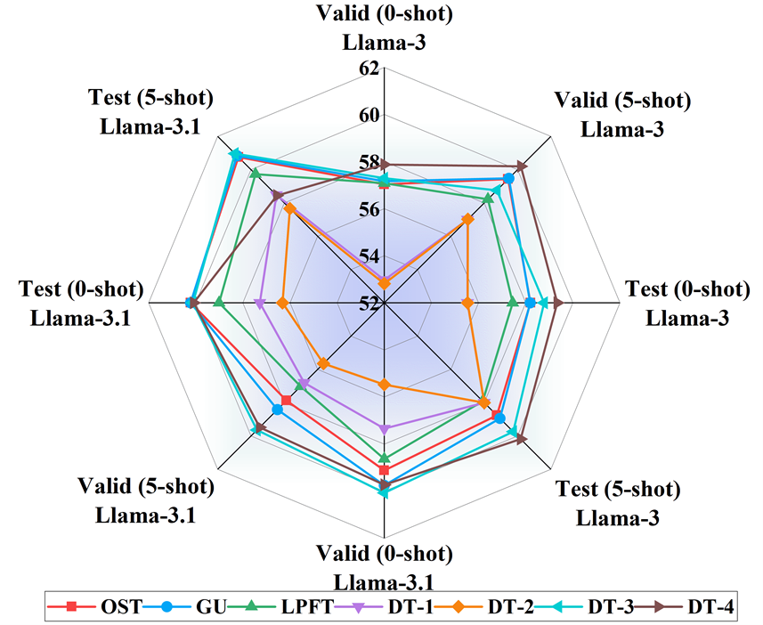
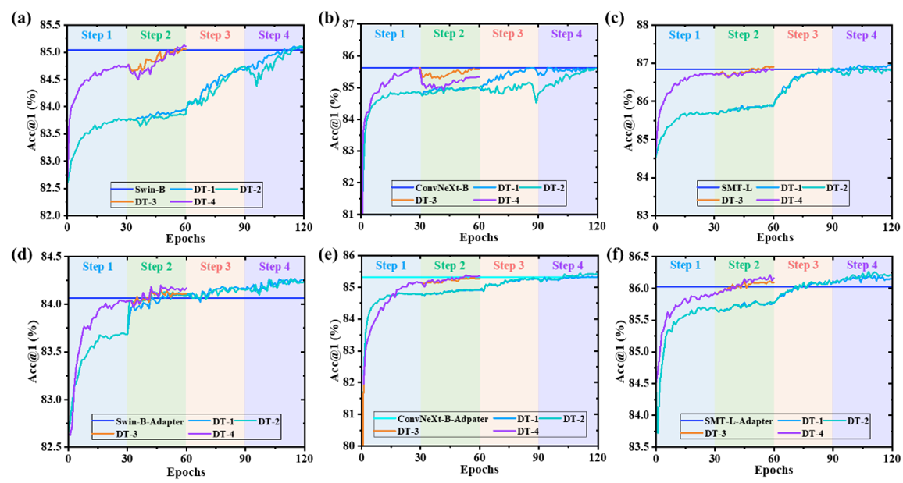
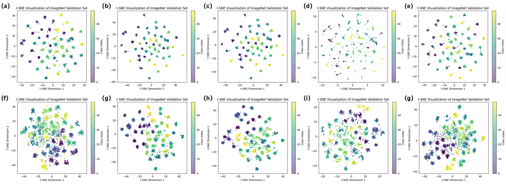

# Diffusion-Tuning
This is the code base for **`"Step-by-step Fine-Tuning Strategy for Deep Neural Networks"`**, and the article is submitted to **`IEEE Transactions on Neural Networks and Learning Systems`**.

## Abstract
As data size and computational power increase, the pre-training + fine-tuning paradigm emerges in deep learning, where fine-tuning determines the model's performance on a new target task. Currently, mainstream methods, such as full fine-tuning (FFT) or parameter-efficient fine-tuning (PEFT), uniformly optimize all training parameters within a specified epoch, collectively referred to as one-step tuning (OST). However, OST encounters the challenge of model performance failing to improve with increased training time, tending to saturate or even decline at some point. Consequently, we introduce the concept of step-by-step tuning (SST), which refers to the training method of fine-tuning a model by progressively optimizing the parameters of different parts of the model in a specific order or strategy, allowing the model to be better adapted to new tasks. Inspired by the physical diffusion process, we propose a novel SST method, diffusion tuning, which divides the neural network parameter space into multiple subspaces and progressively optimizes each using a staged training strategy. Experiments conducted on three visual models and two language models demonstrate that diffusion tuning effectively reduces the difficulty of finding the global optimum during training and enhances the baseline model's performance across various tasks with good generalization. Finally, we develop AgriMaTech-LLaMA, a large-scale language model for agricultural mechanization education based on diffusion tuning, and verified its practical value.




## Results
**To learn more detail please read our paper**.






## Train and Test
We have provided detailed instructions for model training and testing and experimental details. 
### Install
- Clone this repo:

```bash
conda create -n dt python=3.10 -y
conda activate dt
git clone https://github.com/CAU-COE-VEICLab/Diffusion-Tuning.git
cd Diffusion-Tuning
```
- Install `CUDA>=10.2` with `cudnn>=7` following
  the [official installation instructions](https://docs.nvidia.com/cuda/cuda-installation-guide-linux/index.html)
- Install `PyTorch>=1.8.0` and `torchvision>=0.9.0` with `CUDA>=10.2`:

```bash
pip install torch==1.10.0+cu111 torchvision==0.11.0+cu111 torchaudio==0.10.0 -f https://download.pytorch.org/whl/torch_stable.html
pip install timm==0.4.12
pip install opencv-python==4.4.0.46 termcolor==1.1.0 yacs==0.1.8 pyyaml scipy
```


### Data preparation

We use standard ImageNet dataset, you can download it from http://image-net.org/. We provide the following two ways to
load data:

- For standard folder dataset, move validation images to labeled sub-folders. The file structure should look like:
  ```bash
  $ tree data
  imagenet
  ├── train
  │   ├── class1
  │   │   ├── img1.jpeg
  │   │   ├── img2.jpeg
  │   │   └── ...
  │   ├── class2
  │   │   ├── img3.jpeg
  │   │   └── ...
  │   └── ...
  └── val
      ├── class1
      │   ├── img4.jpeg
      │   ├── img5.jpeg
      │   └── ...
      ├── class2
      │   ├── img6.jpeg
      │   └── ...
      └── ...
 
  ```

### Evaluation

To evaluate a pre-trained `Swin Transformer` on ImageNet val, run:

```bash
python -m torch.distributed.launch --nproc_per_node <num-of-gpus-to-use> --master_port 12345 main.py --eval \
--cfg <config-file> --resume <checkpoint> --data-path <imagenet-path> 
```

For example, to evaluate the `Swin-B` with a single GPU:

```bash
python -m torch.distributed.launch --nproc_per_node 1 --master_port 12345 main.py --eval \
--cfg configs/swin/swin_base_patch4_window7_224.yaml --resume swin_base_patch4_window7_224.pth --data-path <imagenet-path>
```

### Fine-tuning from a ImageNet-22K(21K) pre-trained model

For example, to fine-tune a `Swin-B` model pre-trained on ImageNet-22K(21K):

```bashs
python -m torch.distributed.launch --nproc_per_node 8 --master_port 12345  main.py \
--cfg configs/swin/swin_base_patch4_window7_224_22kto1k_finetune.yaml --pretrained swin_base_patch4_window7_224_22k.pth \
--data-path <imagenet-path> --batch-size 64 --accumulation-steps 2 [--use-checkpoint]
```

## Citation
